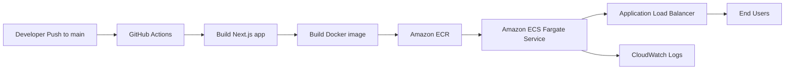
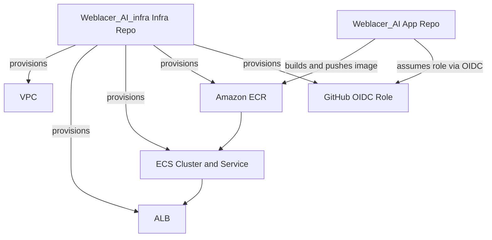
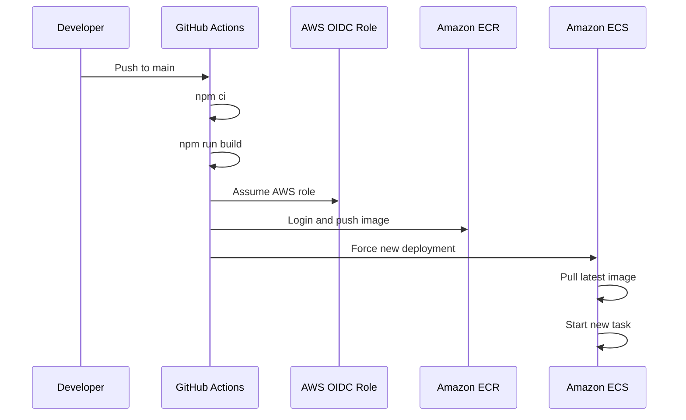
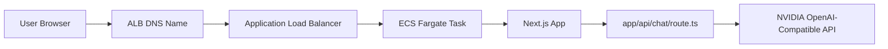

# Weblacer_AI

<div align="center">

# 🚀 Weblacer AI

**Production-ready Next.js application for the Weblacer brand experience, now documented for AWS ECS deployment.**

[](https://weblacer-ai-y3v1.vercel.app)
[](https://github.com/Sujaltalreja04/Weblacer_AI)
[](https://github.com/Sujaltalreja04/Weblacer_AI_infra)
[](https://aws.amazon.com/ecs/)

</div>

---

## ✨ What this repo contains

This repository contains the **Weblacer AI application** built with **Next.js 14**, **React**, **TypeScript**, and modern UI tooling.

It now also includes:

- a **Dockerfile** for container builds
- a **GitHub Actions deployment workflow** for AWS
- deployment documentation aligned with the infra repo
- visual architecture and flow diagrams for team understanding

---

## 🧱 Tech stack

- **Framework:** Next.js 14
- **Language:** TypeScript
- **UI:** React, Tailwind CSS, Framer Motion, Lucide React
- **AI integration:** OpenAI-compatible SDK with NVIDIA endpoint
- **Runtime target:** Docker on **AWS ECS Fargate**
- **CI/CD:** GitHub Actions

---

## 📦 Repository purpose in the platform

This repo is the **application repo**.

The paired infra repository is:

- **Infra repo:** https://github.com/Sujaltalreja04/Weblacer_AI_infra

### Responsibility split

| Repository | Responsibility |
|---|---|
| `Weblacer_AI` | App code, Docker image build, deployment workflow |
| `Weblacer_AI_infra` | AWS infrastructure, Terraform, ECS/ECR/ALB/VPC/IAM |

---

## 🏗️ High-level architecture



---

## 🧭 Infrastructure relationship



---

## 🔄 CI/CD deployment flow



---

## 📁 Important files added for deployment

| File | Purpose |
|---|---|
| `.github/workflows/deploy-ecs.yml` | CI/CD workflow for building and deploying to ECS |
| `Dockerfile` | Container image definition for production |
| `.dockerignore` | Keeps Docker builds small and clean |
| `README.md` | Team-friendly application and deployment guide |

---

## 🚀 Deployment target

This repo is prepared to deploy to the AWS infrastructure already planned in the infra repo.

### Current deployment assumptions

| Setting | Value |
|---|---|
| AWS Region | `us-east-1` |
| ECS Platform | `Fargate` |
| ECR Repository | `weblacer-ai-prod` |
| ECS Cluster | `weblacer-ai-prod-cluster` |
| ECS Service | `weblacer-ai-prod-service` |
| Container Name | `weblacer-ai` |
| App Port | `3000` |

If these values change in Terraform, update the workflow too.

---

## 🔐 GitHub secrets required

Set this secret in the **Weblacer_AI** repo:

| Secret | Required | Description |
|---|---|---|
| `AWS_ROLE_ARN` | Yes | IAM role ARN created by Terraform OIDC module |

### Optional future secrets
If you later move sensitive runtime configuration out of code, add them as ECS task environment variables through Terraform or AWS Secrets Manager / SSM Parameter Store.

---

## ⚠️ Important security note

The file `app/api/chat/route.ts` currently contains an embedded API key.

That is **not recommended for production**.

### Recommended fix
Move the key into a secure secret store and inject it via environment variables, for example:

- AWS Secrets Manager
- AWS Systems Manager Parameter Store
- GitHub Actions secret passed into ECS through Terraform-managed task definitions

Suggested runtime variable name:

```bash
NVIDIA_API_KEY
```

---

## 🐳 Docker image behavior

The Dockerfile uses a multi-stage build:

1. install dependencies
2. build the Next.js application
3. create a smaller runtime image
4. run the app on port `3000`

### Container start command

```bash
npm run start -- -p 3000
```

---

## 🛠️ Local development

### 1. Install dependencies

```bash
npm install
```

### 2. Run locally

```bash
npm run dev
```

### 3. Build locally

```bash
npm run build
```

### 4. Start production mode locally

```bash
npm run start
```

---

## 🧪 Local Docker testing

Build the image:

```bash
docker build -t weblacer-ai:local .
```

Run the container:

```bash
docker run -p 3000:3000 weblacer-ai:local
```

Then visit:

```text
http://localhost:3000
```

---

## 📚 Deployment checklist

### Before first deployment

- [ ] Merge the infra PR in `Weblacer_AI_infra`
- [ ] Apply Terraform bootstrap stack
- [ ] Apply prod Terraform environment
- [ ] Copy the generated `AWS_ROLE_ARN`
- [ ] Add `AWS_ROLE_ARN` secret in this repo
- [ ] Confirm ECS cluster, service, and ECR names match workflow values
- [ ] Confirm app health on port `3000`

### For every deployment

- [ ] Push code to `main`
- [ ] GitHub Actions builds app and Docker image
- [ ] Image is pushed to ECR
- [ ] ECS service is refreshed
- [ ] Verify service health through ALB

---

## 🧠 Team explanation: how everything fits together

### App repo flow
- developers change application code here
- GitHub Actions builds and packages the app
- Docker image is pushed to Amazon ECR
- ECS service pulls the updated image

### Infra repo flow
- Terraform creates the AWS foundation
- networking, IAM, ALB, ECS, ECR, and logs are managed there
- GitHub OIDC trust allows this repo to deploy without long-lived AWS keys

This keeps responsibilities clean and makes the platform easier to operate.

---

## 🌍 Runtime path for a user request



---

## 🗂️ Project structure snapshot

```text
Weblacer_AI/
├── .github/workflows/
│   └── deploy-ecs.yml
├── app/
│   ├── api/
│   │   └── chat/route.ts
│   ├── components/
│   └── ...
├── Dockerfile
├── .dockerignore
├── package.json
├── next.config.js
└── README.md
```

---

## 📈 Suggested next improvements

Here are the best next upgrades for the team:

1. **Move embedded API keys to secrets management**
2. **Add ECS task health endpoint**, such as `/api/health`
3. **Add preview/staging environment**
4. **Add image scanning/security checks in CI**
5. **Add Terraform-managed app environment variables**
6. **Add HTTPS later when a real custom domain is available**

---

## 🤝 Contribution guide

When contributing:

1. create a feature branch
2. test locally with `npm run dev`
3. validate production build with `npm run build`
4. open a PR
5. after merge, `main` triggers deployment

---

## 📬 Useful links

- **Application repo:** https://github.com/Sujaltalreja04/Weblacer_AI
- **Infrastructure repo:** https://github.com/Sujaltalreja04/Weblacer_AI_infra
- **Live site:** https://weblacer-ai-y3v1.vercel.app

---

## ✅ Summary

This repo now supports a cleaner production story:

- application code stays here
- infrastructure lives in Terraform separately
- deployments can run through GitHub Actions to AWS ECS
- documentation is clearer for developers, reviewers, and operators

---

**Generated with care by Aiden for easier team onboarding and smoother AWS delivery.**
